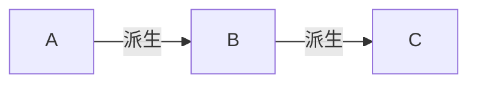

# 程序设计与算法（三）第06周测验002:Fun和Do

本文是中国大学MOOC，北京大学[程序设计与算法（三）C++面向对象程序设计](https://www.icourse163.org/learn/PKU-1002029030#/learn/announce)第六周测验。本课程学习的[github仓库](https://github.com/mrcangye/PKU_Cplus_2020Spring)欢迎Fork

总时间限制: 

1000ms

内存限制: 

65536kB

描述

程序填空输出指定结果

```cpp
#include <iostream> 
using namespace std;
class A { 
	private: 
	int nVal; 
	public: 
	void Fun() 
	{ cout << "A::Fun" << endl; }; 
	void Do() 
	{ cout << "A::Do" << endl; } 
}; 
class B:public A { 
	public: 
	virtual void Do() 
	{ cout << "B::Do" << endl;} 
}; 
class C:public B { 
	public: 
	void Do( ) 
	{ cout <<"C::Do"<<endl; } 
	void Fun() 
	{ cout << "C::Fun" << endl; } 
}; 
void Call(
// 在此处补充你的代码
) { 
	p.Fun(); p.Do(); 
} 
int main() { 
	C c; 
	Call( c); 
	return 0;
}
```

输入

无输出

```cpp
A::Fun
C::Do
```

老规矩：先看主函数

```cpp
int main() { 
	C c; 
	Call( c); 
	return 0;
}
```

emmm，没啥可看的。主函数生成了一个`C`对象，有一个`Call(c)`函数

再看类

```cpp
class A { 
	private: 
	int nVal; 
	public: 
	void Fun() 
	{ cout << "A::Fun" << endl; }; 	//输出第一行是这个
	void Do() 
	{ cout << "A::Do" << endl; } 
}; 
class B:public A { 
	public: 
	virtual void Do() 
	{ cout << "B::Do" << endl;} 
}; 
class C:public B { 
	public: 
	void Do( ) 
	{ cout <<"C::Do"<<endl; } 	//输出第二行是这个
	void Fun() 
	{ cout << "C::Fun" << endl; } 
}; 
void Call(
// 在此处补充你的代码
) { 
	p.Fun(); p.Do(); 
} 
```

这里的关系是：



注意：`B`中`Do()`是虚函数，所以根据上课讲的知识点：

> 派生类和基类同名同参数表的函数，不加`virtualenv`也自动成为虚函数

`C`中的`Do()`也是虚函数

这里需要在`Call`函数里填写参数，使之得到期望的结果

我们要使用到`A.Fun()`，`C.Do()`这两个函数

再看看`B`中是没有`Fun()`的，所以`B`的`Fun()`是继承`A`的。第一行的打印就解决了。

第二行的打印，由于`C.Do()`是虚函数，也就解决了

所以我们可以写出：

```cpp
void Call(B &p) { 
	p.Fun(); p.Do(); 
} 
```

提交，通过