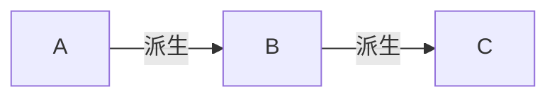

# 程序设计与算法（三）第06周测验004:怎么又是Fun和Do

本文是中国大学MOOC，北京大学[程序设计与算法（三）C++面向对象程序设计](https://www.icourse163.org/learn/PKU-1002029030#/learn/announce)第六周测验。本课程学习的[github仓库](https://github.com/mrcangye/PKU_Cplus_2020Spring)欢迎Fork

总时间限制: 

1000ms

内存限制: 

65536kB

描述

程序填空输出指定结果

```cpp
#include <iostream>
using namespace std;
class A {
	private:
	int nVal;
	public:
	void Fun()
	{ cout << "A::Fun" << endl; };
	virtual void Do()
	{ cout << "A::Do" << endl; }
};
class B:public A {
	public:
	virtual void Do()
	{ cout << "B::Do" << endl;}
};
class C:public B {
	public:
	void Do( )
	{ cout <<"C::Do"<<endl; }
	void Fun()
	{ cout << "C::Fun" << endl; }
};
void Call(
// 在此处补充你的代码
) {
	p->Fun(); p->Do();
}
int main() {
	Call( new A());
	Call( new C());
	return 0;
}
```

输入

无

输出

```cpp
A::Fun
A::Do
A::Fun
C::Do
```

先看主函数

```cpp
int main() {
	Call( new A());
	Call( new C());
	return 0;
}
```

emmm，两个`Call`函数，其中参数是新建的类`A`和`C`的对象

```cpp
void Call(
// 在此处补充你的代码
) {
	p->Fun(); p->Do();
}
```

看看类

```cpp
class A {
	private:
	int nVal;
	public:
	void Fun()
	{ cout << "A::Fun" << endl; };
	virtual void Do()
	{ cout << "A::Do" << endl; }
};
class B:public A {
	public:
	virtual void Do()
	{ cout << "B::Do" << endl;}
};
class C:public B {
	public:
	void Do( )
	{ cout <<"C::Do"<<endl; }
	void Fun()
	{ cout << "C::Fun" << endl; }
};
```



输出是

```cpp
A::Fun	//A.Fun()输出
A::Do	//A.Do()
A::Fun	//A.Fun()
C::Do	//C.Do()
```

注意，主函数里的`Call`的参数是`new`一个新的空间。所以我们必须用指针，不可以用`&`。

但是这里怎么会出现`A::Fun()`呢？

因为我们看到`Do()`函数是虚函数，`A`,`B`,`C`类里的`Do`都是虚函数，所以哪个类运行的`Do`函数，调用的就是哪个类的`Do`。

`Fun()`就不一样了，只有在`A`和`C`中有。

想要输出`A::Fun()`，那么我们只能这样写

`A *p`

即

```cpp
void Call(A *p) {
	p->Fun(); p->Do();
}
```

这样写的话，`Do()`函数的调用是正常的。当`Call( new C());`时，因为指针是`A *`，故调用的是`A.Fun()`，与输出相符

`A * p`指向`C`是可以的，因为`C`是`A`的派生

提交，通过


